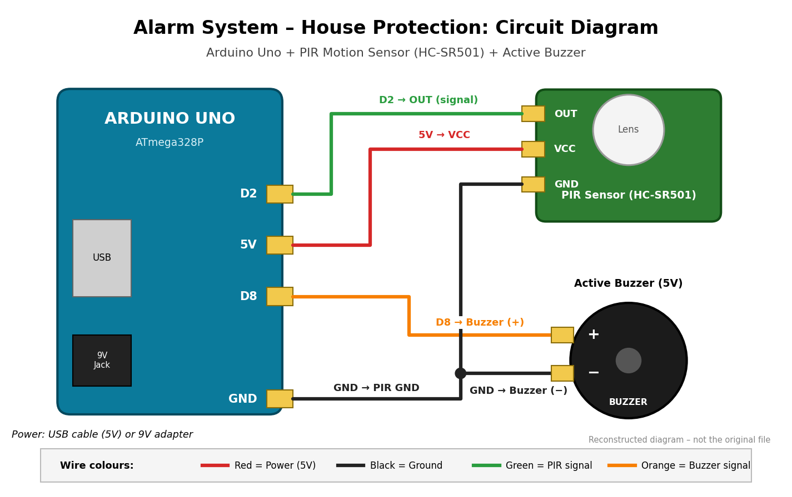

<div align="center">

# SUPERIOR UNIVERSITY LAHORE
### Department of Computer Science

---

# ALARM SYSTEM – HOUSE PROTECTION

### Physics Lab Project Report
**BS Cybersecurity – Semester 1**

---

| | |
|---|---|
| **Submitted by** | M. Ahmad Raza |
| **Roll Number** | SU92-BSCBM-F23-052 |
| **Course** | Physics Lab |
| **Submitted to** | *(Instructor name)* |
| **Session** | Fall 2023 |

</div>

> **Note on reconstruction:** The original photos, circuit diagram, and code for this project are no longer available. This report, the circuit diagram, the setup image, and the Arduino code were **reconstructed** from the original project concept. They are not the original historical files, and the setup image is an illustration, not a photograph.

---

## Table of Contents

1. [Introduction](#1-introduction)
2. [Problem Statement](#2-problem-statement)
3. [Objectives](#3-objectives)
4. [Components and Their Functions](#4-components-and-their-functions)
5. [Circuit Diagram](#5-circuit-diagram)
6. [Circuit Connections and Pin Details](#6-circuit-connections-and-pin-details)
7. [Working Principle](#7-working-principle)
8. [Physics Concepts Used](#8-physics-concepts-used)
9. [Arduino Code](#9-arduino-code)
10. [Explanation of the Code](#10-explanation-of-the-code)
11. [Project Setup](#11-project-setup)
12. [Features](#12-features)
13. [Advantages](#13-advantages)
14. [Limitations](#14-limitations)
15. [Future Improvements](#15-future-improvements)
16. [Testing and Expected Results](#16-testing-and-expected-results)
17. [Conclusion](#17-conclusion)
18. [References](#18-references)

---

## 1. Introduction

Home security is important for everyone. Burglaries often happen when a house is empty or when people are asleep. Alarm systems help by warning people when someone enters a room without permission.

This project is a simple **home security alarm** made with an **Arduino Uno** microcontroller. A **PIR (Passive Infrared) motion sensor** detects movement inside a room. When movement is detected, the Arduino turns on a **buzzer**, which makes a loud beeping sound to warn the people nearby.

The project combines ideas from physics, such as **infrared radiation, electric current, voltage, and sound**, with basic electronics and programming. It was made as a First Semester Physics Lab project.

## 2. Problem Statement

Houses can be entered by unauthorized people, especially when the owners are away or sleeping. Commercial security systems can be expensive for many families and students.

**Problem:** A low-cost, simple system is needed that can detect movement inside a room and give an immediate warning.

**Solution:** An Arduino-based alarm system that uses a PIR sensor to detect motion and a buzzer to sound an alarm.

## 3. Objectives

The main objectives of this project are:

1. To design a simple alarm system that detects motion inside a house.
2. To use a PIR sensor to detect infrared radiation changes caused by a moving person.
3. To use an Arduino Uno to read the sensor signal and control a buzzer.
4. To learn how current, voltage, and sound are used in a real circuit.
5. To build a low-cost project using easily available components.
6. To gain basic practical experience with sensors and microcontrollers.

## 4. Components and Their Functions

| # | Component | Function in the Project |
|---|-----------|-------------------------|
| 1 | **Arduino Uno** | The "brain" of the system. It reads the signal from the PIR sensor and decides when to turn the buzzer on or off. |
| 2 | **PIR Motion Sensor (HC-SR501)** | Detects changes in infrared (heat) radiation caused by a moving human body. It sends a HIGH signal when motion is detected. |
| 3 | **Active Buzzer (5V)** | Produces a loud beeping sound when it receives a HIGH signal from the Arduino. It has a built-in oscillator, so no tone code is needed. |
| 4 | **Jumper / Connecting Wires** | Connect the Arduino, PIR sensor, and buzzer to each other. |
| 5 | **Power Supply (USB or 9V)** | Provides electrical power. The USB cable gives 5V from a computer or phone charger. A 9V adapter or battery can be connected to the DC jack. |

### Important details about the PIR sensor (HC-SR501)

- Operating voltage: about 5V to 20V (powered from the Arduino 5V pin)
- Output: HIGH (about 3.3V) when motion is detected, LOW otherwise
- Detection range: about 3 to 7 metres (adjustable with the onboard knob)
- Detection angle: about 110°
- Needs about 30–60 seconds to stabilize after power-on

## 5. Circuit Diagram



*Figure 1: Circuit diagram of the Alarm System showing the Arduino Uno, PIR sensor, and buzzer. (Reconstructed diagram.)*

## 6. Circuit Connections and Pin Details

### Connection table

| # | From (Arduino) | To (Component) | Wire Colour | Purpose |
|---|----------------|----------------|-------------|---------|
| 1 | **5V** | PIR **VCC** | Red | Power for the PIR sensor |
| 2 | **GND** | PIR **GND** | Black | Common ground |
| 3 | **Digital Pin 2 (D2)** | PIR **OUT** | Green | Motion signal (input to Arduino) |
| 4 | **Digital Pin 8 (D8)** | Buzzer **+** (long leg) | Orange | Alarm control signal (output) |
| 5 | **GND** | Buzzer **−** (short leg) | Black | Ground return for the buzzer |

### Pin details

| Arduino Pin | Mode | Connected To | Description |
|-------------|------|--------------|-------------|
| D2 | INPUT | PIR OUT | Reads HIGH (motion) or LOW (no motion) |
| D8 | OUTPUT | Buzzer + | HIGH turns the buzzer on, LOW turns it off |
| 5V | Power | PIR VCC | Supplies 5V to the sensor |
| GND | Ground | PIR GND, Buzzer − | Common ground for all components |

**Notes:**
- The PIR sensor's OUT pin sends a signal; it does not supply power to anything else.
- An active buzzer has polarity. The **long leg (+)** must go to D8, and the **short leg (−)** must go to GND.
- The buzzer used is a small 5V active buzzer that draws a low current, so it can be driven directly from an Arduino pin.

## 7. Working Principle

The system works in the following steps:

1. **Power on:** The Arduino is powered through USB (5V) or the 9V DC jack. The sensor and buzzer receive power from the Arduino.
2. **Warm-up:** The PIR sensor needs about 30 seconds to adjust to the room's normal infrared level. During this time, the Arduino waits and the Serial Monitor shows "Warming up PIR sensor".
3. **System armed:** After warm-up, the Serial Monitor shows "System ARMED". The Arduino now keeps checking the signal on pin D2.
4. **Normal condition:** If nobody moves in front of the sensor, the PIR output stays **LOW**. The buzzer stays **OFF**.
5. **Motion detected:** When a person moves in front of the sensor, the PIR detects a change in infrared radiation. The PIR output (OUT) goes **HIGH**.
6. **Arduino reads the signal:** The Arduino reads HIGH on pin D2 using `digitalRead()`.
7. **Alarm activated:** The Arduino sends HIGH signals to pin D8 in short pulses (200 ms ON, 100 ms OFF). The buzzer beeps loudly.
8. **Alarm ends:** After 5 seconds, the Arduino turns the buzzer off and returns to monitoring.
9. **Repeat:** If movement is still detected, the alarm starts again. Otherwise the system stays in normal condition.

### Block diagram (simple flow)

```
 Moving person
      │  (infrared radiation change)
      ▼
 PIR Sensor ──(HIGH signal on OUT)──► Arduino Uno (D2)
                                          │
                                  (decision in code)
                                          ▼
                                    Arduino (D8)
                                          │
                                          ▼
                                       Buzzer ──► Alarm sound
```

## 8. Physics Concepts Used

| Concept | How it appears in this project |
|---------|-------------------------------|
| **Infrared radiation** | Every warm object, including the human body, gives off infrared radiation. The PIR sensor detects changes in this radiation. |
| **Electric current and voltage** | The Arduino supplies 5V that makes current flow through the sensor and the buzzer. |
| **Ohm's Law (V = I × R)** | The current drawn by the sensor and the buzzer depends on the voltage and their internal resistance. |
| **Electric circuit** | The components form a complete circuit with power (5V), a signal path, and a ground return. |
| **Sound waves** | The buzzer's vibrating element makes the air vibrate, creating sound waves that we hear as the alarm. |
| **Digital signals** | The sensor and buzzer use HIGH (about 5V) and LOW (0V) logic levels. |

**How the PIR sensor works (simple explanation):** The sensor has two small infrared-sensitive elements side by side. When nothing moves, both see the same level of infrared radiation and the output stays LOW. When a warm body passes in front of the sensor, one element sees the change before the other. This difference is detected, and the sensor outputs a HIGH signal. A white dome (Fresnel lens) in front of the sensor helps focus infrared radiation onto these elements.

## 9. Arduino Code

The complete code is in the separate file **[`alarm_system.ino`](alarm_system.ino)**. It is shown below for reference.

```cpp
/*
  Alarm System - House Protection
  First Semester Physics Lab Project
  Superior University Lahore - BS Cybersecurity

  NOTE: This is a reconstructed version of the original project code.

  Board  : Arduino Uno
  Sensor : PIR Motion Sensor (HC-SR501) -> OUT connected to Digital Pin 2
  Output : Active Buzzer                -> (+) connected to Digital Pin 8
*/

const int pirPin    = 2;   // PIR sensor OUT pin
const int buzzerPin = 8;   // Buzzer positive (+) pin

const unsigned long warmUpTime   = 30000; // PIR warm-up: 30 seconds
const unsigned long alarmTime    = 5000;  // Alarm sounds for 5 seconds
const int           beepOnTime   = 200;   // Buzzer ON  for 200 ms
const int           beepOffTime  = 100;   // Buzzer OFF for 100 ms

void setup() {
  pinMode(pirPin, INPUT);
  pinMode(buzzerPin, OUTPUT);
  digitalWrite(buzzerPin, LOW);

  Serial.begin(9600);
  Serial.println("Alarm System - House Protection");
  Serial.println("Warming up PIR sensor (30 seconds)...");

  delay(warmUpTime);

  Serial.println("System ARMED. Monitoring for motion...");
}

void loop() {
  int motion = digitalRead(pirPin);

  if (motion == HIGH) {
    Serial.println("ALERT: Motion detected! Alarm ON");
    soundAlarm();
    Serial.println("Alarm OFF. Monitoring again...");
  } else {
    digitalWrite(buzzerPin, LOW);
  }
}

// Beeps the buzzer repeatedly for the alarm duration
void soundAlarm() {
  unsigned long startTime = millis();

  while (millis() - startTime < alarmTime) {
    digitalWrite(buzzerPin, HIGH);
    delay(beepOnTime);
    digitalWrite(buzzerPin, LOW);
    delay(beepOffTime);
  }
  digitalWrite(buzzerPin, LOW);
}
```

## 10. Explanation of the Code

| Part of Code | Explanation |
|--------------|-------------|
| `const int pirPin = 2;` | Stores the pin number connected to the PIR sensor's OUT pin. |
| `const int buzzerPin = 8;` | Stores the pin number connected to the buzzer's positive leg. |
| `warmUpTime = 30000` | The PIR sensor needs about 30 seconds to stabilize. The time is in milliseconds (30000 ms = 30 s). |
| `alarmTime = 5000` | The alarm sounds for 5 seconds each time motion is detected. |
| `beepOnTime`, `beepOffTime` | Control the beeping pattern: 200 ms ON, then 100 ms OFF. |
| `pinMode(pirPin, INPUT);` | Sets pin D2 as an input to read the sensor. |
| `pinMode(buzzerPin, OUTPUT);` | Sets pin D8 as an output to control the buzzer. |
| `Serial.begin(9600);` | Starts serial communication so messages can be shown in the Serial Monitor. |
| `delay(warmUpTime);` | Waits 30 seconds for the PIR sensor to warm up. |
| `digitalRead(pirPin)` | Reads whether the sensor output is HIGH (motion) or LOW (no motion). |
| `if (motion == HIGH)` | Checks if motion was detected. If yes, the alarm function is called. |
| `soundAlarm()` | Turns the buzzer ON and OFF repeatedly for 5 seconds to make a beeping sound. |
| `millis()` | Returns the time in milliseconds since the Arduino started. It is used to measure how long the alarm has been sounding. |
| `digitalWrite(buzzerPin, HIGH/LOW)` | Turns the buzzer on (HIGH, 5V) or off (LOW, 0V). |

**Program flow:** `setup()` runs once, and then `loop()` runs again and again. Inside `loop()`, the Arduino reads the sensor. If it sees motion, it calls `soundAlarm()`. Otherwise, it keeps the buzzer off.

**Note:** The PIR sensor keeps its output HIGH for a few seconds after detecting movement (this hold time can be adjusted with the onboard potentiometer). So the alarm may repeat while the output is still HIGH.

## 11. Project Setup


*Figure 2: Illustration of the project setup showing the Arduino Uno, PIR sensor, buzzer, and connecting wires. (Reconstructed illustration, not an original photograph.)*

**Setup steps:**
1. Connect PIR **VCC** to Arduino **5V** (red wire).
2. Connect PIR **GND** to Arduino **GND** (black wire).
3. Connect PIR **OUT** to Arduino **D2** (green wire).
4. Connect the buzzer **+** (long leg) to Arduino **D8** (orange wire).
5. Connect the buzzer **−** (short leg) to Arduino **GND** (black wire).
6. Connect the Arduino to a computer with a USB cable and upload `alarm_system.ino`.
7. Wait about 30 seconds for the sensor to warm up, then test by moving in front of it.

## 12. Features

- Automatic motion detection using a PIR sensor
- Loud beeping alarm from the buzzer
- Simple circuit with only three main components
- 30-second warm-up for stable sensor readings
- Serial Monitor messages for easy testing and debugging
- Can be powered by USB (5V) or a 9V supply
- Low cost and easy to build

## 13. Advantages

1. **Low cost:** Uses cheap and easily available components.
2. **Simple design:** Easy to build, understand, and explain.
3. **Low power use:** The PIR sensor uses very little power.
4. **Contactless detection:** Detects motion without touching anything.
5. **Fast response:** The alarm sounds almost immediately after motion.
6. **Educational value:** Teaches sensors, circuits, and Arduino programming.
7. **Easy to upgrade:** New features can be added by changing the code or adding modules.

## 14. Limitations

1. The PIR sensor **cannot tell the difference** between a person, a pet, or another heat source.
2. It has a **limited range** (about 3–7 metres) and detection angle (about 110°).
3. It can give **false alarms** because of sudden heat changes such as sunlight, heaters, or hot air.
4. The alarm is **local only**. It does not send a message or call anyone.
5. There is **no way to turn the alarm off** except by unplugging or resetting the Arduino.
6. There is **no battery backup**. If power is cut, the system stops working.
7. The code uses `delay()`, so the Arduino cannot do other tasks during the alarm.
8. It is a prototype for learning and is **not a replacement** for a professional security system.

## 15. Future Improvements

1. Add an **ON/OFF switch** or **keypad** to arm and disarm the system.
2. Add an **LED** to show the system status (armed or alarm).
3. Add a **GSM module** or **Wi-Fi module (ESP8266/ESP32)** to send SMS or phone notifications.
4. Add a **rechargeable battery** for backup power.
5. Use **multiple PIR sensors** to cover several rooms or entrances.
6. Add a **door/window magnetic sensor** for more protection.
7. Replace `delay()` with `millis()`-based timing so the Arduino can do other tasks at the same time.
8. Add an **LCD display** to show system messages.
9. Add a **camera module** to capture a picture when motion is detected.

## 16. Testing and Expected Results

The following tests are designed to check that the system works correctly. The results below are the **expected results** for a correctly built system.

| Test No. | Test Condition | Expected Result | Expected Serial Monitor Message |
|----------|----------------|-----------------|--------------------------------|
| 1 | Power on the system | Buzzer stays OFF during warm-up | `Warming up PIR sensor (30 seconds)...` |
| 2 | After warm-up, no movement | Buzzer stays OFF | `System ARMED. Monitoring for motion...` |
| 3 | A person walks in front of the sensor (within about 5 m) | Buzzer beeps for 5 seconds | `ALERT: Motion detected! Alarm ON` |
| 4 | Alarm time ends, no more movement | Buzzer stops | `Alarm OFF. Monitoring again...` |
| 5 | Person stands still in front of the sensor | No new alarm after the sensor resets | *(no new message)* |
| 6 | Movement beyond the sensor range | No alarm | *(no new message)* |
| 7 | Hand waved close to the sensor | Alarm sounds | `ALERT: Motion detected! Alarm ON` |

**Troubleshooting guide:**

| Problem | Possible Cause | Solution |
|---------|----------------|----------|
| Buzzer always ON | Sensor still warming up or very sensitive | Wait 30–60 seconds; reduce the sensitivity knob |
| No sound at all | Wrong buzzer polarity or loose wire | Check that + goes to D8 and − goes to GND |
| No motion detected | OUT wire not on D2 or no power | Check VCC, GND, and OUT connections |
| Random false alarms | Heat source or sunlight nearby | Move the sensor away from windows and heaters |

## 17. Conclusion

This project successfully demonstrates a simple and low-cost home security alarm using an Arduino Uno, a PIR motion sensor, and a buzzer. The PIR sensor detects changes in infrared radiation caused by human movement and sends a signal to the Arduino. The Arduino then activates the buzzer to warn people nearby.

The project helped in understanding important physics ideas such as infrared radiation, electric current and voltage, simple circuits, and sound generation. It also gave practical experience with sensors, microcontrollers, and basic programming.

Although the system has limitations, such as false alarms and no remote notifications, it can be improved with extra modules like GSM or Wi-Fi. This project is a good first step toward more advanced security and Internet of Things (IoT) systems.

## 18. References

1. Arduino. *Arduino Uno Rev3 – Documentation.* https://docs.arduino.cc/hardware/uno-rev3/
2. Arduino. *digitalRead() – Arduino Reference.* https://www.arduino.cc/reference/en/language/functions/digital-io/digitalread/
3. Arduino. *digitalWrite() – Arduino Reference.* https://www.arduino.cc/reference/en/language/functions/digital-io/digitalwrite/
4. Arduino. *millis() – Arduino Reference.* https://www.arduino.cc/reference/en/language/functions/time/millis/
5. HC-SR501 PIR Motion Detector Module – Manufacturer Datasheet.
6. Microchip. *ATmega328P Datasheet.* https://www.microchip.com/en-us/product/ATmega328P
7. Halliday, D., Resnick, R., & Walker, J. *Fundamentals of Physics.* Wiley. (Topics: electric current, Ohm's law, thermal radiation, sound waves.)
8. Monk, S. *Programming Arduino: Getting Started with Sketches.* McGraw-Hill.

---

<div align="center">

*Prepared by M. Ahmad Raza · BS Cybersecurity · Superior University Lahore*

</div>
